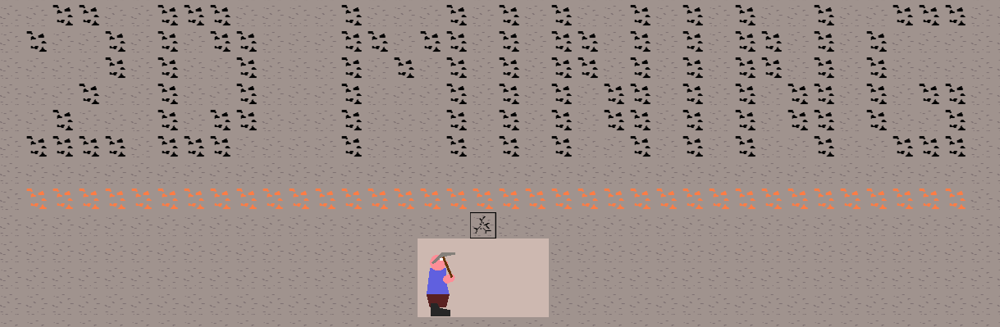

# Dust Dynasty: Diggers Unite

> A mobile-friendly idle clicker mining game — tap to dig, hire workers, prestige for power, and descend into the deep.



## About

Dust Dynasty: Diggers Unite is an idle clicker game built in Godot 4. Tap ore blocks to break them, collect coins, hire auto-mining workers, and purchase upgrades as you descend deeper through procedurally generated underground layers. Prestige to earn Dust currency for permanent bonuses and go even deeper on your next run.

Play it in your browser — no download or app install required.

## Features

- **Tap to mine** — click or tap ore blocks to break them and collect coins
- **Procedural depth** — each layer uses noise-based generation with depth-appropriate ores
- **Registry-driven content** — all ores, upgrades, workers, terrain rules, and config live in `.tres` data files; no code changes needed to add new content
- **Auto workers** — hire diggers, miners, drillers, and blasters for passive income
- **Prestige system** — spend Dust for permanent run-over-run multipliers
- **Offline earnings** — coins accumulate while you're away (capped at 4 hours)
- **Mobile-first** — touch input, portrait viewport, runs in any modern browser

## Project Structure

```
game/clicker/          # All clicker game code (isolated from base sandbox)
  autoload/            # ClickerDataManager, ClickerGameState, ClickerSaveManager
  registries/          # .tres data files for ores, upgrades, workers, terrain, config
  resources/           # GDScript resource class definitions
  scenes/              # DiggingView, ClickerTerrainGenerator, FloatingLabel
  ui/                  # ClickerHUD, ShopPanel, WorkersPanel, PrestigePanel, etc.
assets/                # Sprites, tilesets, fonts, SFX, VFX, UI skins
```

## Built With

- [Godot 4.2](https://godotengine.org/) — GL Compatibility renderer (required for web export)
- GDScript — all game logic
- GitHub Pages — web hosting

## Adding Content

Drop a new `.tres` file into the appropriate registry folder — no code changes required:

| Content type | Registry folder |
|---|---|
| Ore types | `game/clicker/registries/ores/` |
| Upgrades | `game/clicker/registries/upgrades/` |
| Workers | `game/clicker/registries/workers/` |
| Prestige bonuses | `game/clicker/registries/prestige/` |
| Terrain layers | `game/clicker/registries/terrain/` |
| Depth milestones | `game/clicker/registries/milestones/` |

## Credits

See [THIRD_PARTY_CREDITS.md](THIRD_PARTY_CREDITS.md) for all third-party asset credits.

## License

Copyright © 2026 DAILY19. All rights reserved.

This project is based on the [2D Mining Sandbox](https://github.com/Griiimon/2D-Mining) community project, originally licensed under GPL v3. The base sandbox framework code retains its GPL v3 license. All new Dust Dynasty game code in `game/clicker/` is proprietary.
